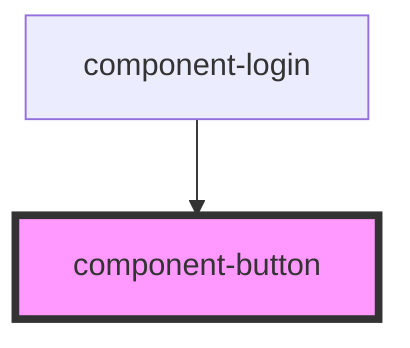

# my-component

<!-- Auto Generated Below -->

## Properties

| Property | Attribute | Description                                                           | Type     | Default     |
| -------- | --------- | --------------------------------------------------------------------- | -------- | ----------- |
| `text`   | `text`    | Button text                                                           | `string` | `undefined` |
| `type`   | `type`    | Used to specify a type of the button. Can be "primary" or "secondary" | `string` | `undefined` |

## Dependencies

### Used by

 - [component-login](../component-login)

### Graph

----------------------------------------------

*Built with [StencilJS](https://stenciljs.com/)*
