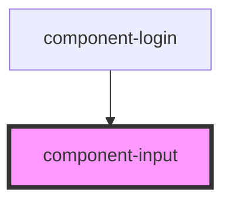

# component-input

<!-- Auto Generated Below -->

## Properties

| Property          | Attribute          | Description                                                           | Type     | Default     |
| ----------------- | ------------------ | --------------------------------------------------------------------- | -------- | ----------- |
| `inputId`         | `input-id`         | Unique id for this input field                                        | `string` | `undefined` |
| `inputType`       | `input-type`       | Type of this input field it can be email, number, text, password etc. | `string` | `'email'`   |
| `labelText`       | `label-text`       | Text for the label that shows above input field                       | `string` | `undefined` |
| `placeholderText` | `placeholder-text` | Text that is used as a placeholder for the input field                | `string` | `''`        |

## Dependencies

### Used by

 - [component-login](../component-login)

### Graph

----------------------------------------------

*Built with [StencilJS](https://stenciljs.com/)*
